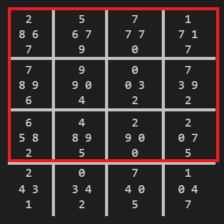

# Tetravex Solveur

Solveur d'un jeu de Tetravex à l'aide d'un algorithme de recuit simulé en C++.

Germain Cassé - germain.casse\
Antoine Julien - antoine.julien

# Présentation du programme

Un algorithme de recuit simulé est utilisé pour résoudre ce jeu.

Limitations du problème :
- Nous avons considéré que chaque grille possède au moins une pièce bien placée, marquée par un "@" dans le fichier d'entrée. Notre programme fonctionne tout de même pour les grilles n'ayant aucune pièce fixe, mais notre programme n'est pas optimisé pour ces grilles.
- Nous nous limitons aux grilles de taille comprises entre 2x2 à 6x6. Encore une fois, notre programme fonctionne pour les grilles plus grandes, mais n'est pas optimisé pour celles-ci.

Pour chaque itération, le programme affiche les valeurs internes du recuit simulé. Ce comportement peut être retiré en ayant le paramètre "verbose" à false.

Utilisation :

- Compilation du programme : `g++ src/*.cc` puis `./a.out in.txt out.txt` avec `in.txt` un fichier d'entrée, `out.txt` un fichier de sortie.
- Création d'une grille de Tetravex : `python3 benchmark/grid_gen.py 6` en spécifiant la dimension souhaitée de la grille (ici 6)

# Notre implémentation du recuit simulé

Notre algorithme de recuit simulé implémente le pseudo-code suivant :

```
ENTRÉE :
- Grille     # la grille de Tetravex
- Lambda
- Tmin
- Tmax
- max_iter

FONCTION resoudre_tetravex :
    E = energie(Grille)
    max_E = nombre_de_frontières(Grille)
    T = Tmax
    
    POUR i allant de 0 à max_iter:
        SI E = max_E :
            retourner Grille       # La grille est résolue
        
        nouvelle_grille = échanger_deux_pièces_aléatoires(Grille)
        nouveau_E = energie(nouvelle_grille)
        
        SI nouveau_E > E OU aléatoire(0, 1) < exponentielle((nouveau_E - E) / T):
            Grille = nouvelle_grille
        
        SI T > Tmin:
            T = Lambda * T

    retourner Grille               # La grille n'a pas été résolue
```

La fonction nombre_de_frontières() correspond au nombre total de contacts entre pièces dans une grille. Il est égal à 2\*N\*(N-1) avec N la dimension de la grille.

L'énergie d'une grille, qu'on obtient avec la fonction energie(), correspond au nombre de frontières qui correspondent. Une grille résolue a une énergie égale à max_E qui vaut nombre_de_frontières(Grille).

La température du recuit va progressivement diminuer d'un facteur Lambda à chaque itération. Une nouvelle grille sera retenue si elle a une énergie plus élevée, ou si une valeur aléatoire entre 0 et 1 est inférieure à `exponentielle((nouveau_E - E) / T)`


# Optimisations mises en place

Pour chaque taille de grille, nous avons tenté d'obtenir les paramètres optimaux pour minimiser le temps de calcul (Lambda, Tmin, Tmax).\
Nous avons choisi de garder **max_iter** à **5.000.000**. Nous considérons qu'au delà de ce nombre, notre programme manque d'optimisation.\
Nous avons également choisi arbitrairement **Tmax = 2**. En effet, cela correspond à une probabilité de transition proche de 60% lorsque la différence d'énergie est de 1, et de 14% lorsque cette différence est de 4, ce qui nous semble suffisemment élevé pour que le départ de l'algorithme soit suffisemment chaotique, sans pour autant qu'il faille attendre trop d'itérations pour que l'algorithme commence à converger. 

Nous avons par la suite décidé de fixer Tmin à **0.2**. Cela force la probabilité de transitionner vers une état d'énergie plus faible à être très faible (inférieure à 0.006 pour une différence d'énergie de 1 ...). C'est après de nombreux essais que cette valeur nous a semblé pertinente, car elle donne une probabilité de transition très faible mais atteignable.\
> En pratique, nous tenterons en fait de ne jamais atteindre Tmin. En effet, il y a de grandes chances pour que le fait d'atteindre Tmin signifie que nous soyons dans un minimum local.

L'étude qui suit va donc uniquement se porter sur l'optimisation de Lambda.

# Benchmarking

La valeur Lambda influe sur la vitesse à laquelle notre recuit simulé va baisser en température (converger vers un minimum local ou global). Il s'agit d'une valeur entre 0 et 1.\
Nous avons constaté deux choses :
- Lorsque Lambda est très proche de 1, notre algorithme trouve toujours la solution (en apparence), puisque le recuit est très libre d'explorer plusieurs minimums locaux et d'en sortir. Cependant, cela peut signifier une convergence lente vers cette grille optimale.
- Losque Lambda est trop proche de 0, c'est le contraire qui se produit : le système va rapidement converger vers un minimum local, et être incapable d'en sortir. En effet, la probabilité de sortir de ce minimum local devient trop faible.

En somme, il faut trouver pour chaque taille de grille un Lambda optimal pour ne pas prendre trop de temps à converger, mais sans prendre le risque de se bloquer dans un minimum local (ce qui se traduit également par un temps de convergence élevé).


- Dans le tableau suivant, nous avons reporté le nombre d'itérations nécessaires pour chaque taille de grille, dans le pire des cas, pour différentes valeurs de Lambda. Chaque case contient le nombre d'itérations maximal sur 5 à 10 tests. Les abcisses correspondent à la taille de la grille, les ordonnées à Lambda. Les valeurs soulignées sont celles où Tmin est parfois atteint, où on peut donc suspecter que le programme est dans un minimum local, duquel lequel il peine grandement à sortir. Ces grilles ont toutes une pièce bien placée située dans un coin.

| Lambda        | 2    | 3    | 4         | 5         | 6         |
|---------------|------|------|-----------|-----------|-----------|
| 0.9           | 7    | <ins>8272<ins>   | <ins>>1M<ins>                   | <ins>>5M<ins>             | <ins>>5M<ins> |
| 0.99          | 6    | <ins>5421<ins>   | <ins>>1M<ins>                   |    <ins>>5M<ins>          |  <ins>>5M<ins> |
| 0.999         | 5    | <ins>4929<ins>   | 450 mais parfois <ins>>1M<ins>  | <ins>>5M<ins>             | <ins>>5M<ins> |
| 0.9999        | 8    | 731              | 4.501                            |  <ins>>5M<ins>           | <ins>>5M<ins> |
| 0.99999       | 6    | 820              | 7.560                            |  <ins>>5M<ins>           | <ins>>5M<ins> |
| 0.999999      | 5    | 756              | 760.441                          |          723.418         | <ins>>5M<ins> |
| 0.9999999     | 6    | 612              | 350.739                          |         2.461.035        | >5M |
| nombre de grilles possibles | 3! = 6 | 8! = 40320 | 15! ≈  10^12 | 24! ≈ 10^24 | 35! ≈ 10^40 |

Nous avons donc retenu les Lambdas suivant :

grille 2x2, 3x3 et 4x4 : Lambda = 0.9999
grille 5x5 : Lambda = 0.999999
grille 6x6 : Lambda = 0.9999999

 - solution optimisée:

Étant donné qu'il existe toujours un risque de se trouver bloqué dans un minimum local lorsque Lambda n'est pas assez grand (exemple dans le tableau avec taille=5 et Lambda=0.999, le programme ne converge pas vers la solution une fois sur 20), nous avons décidé d'augmenter artificiellement T si Tmin est atteint. Nous avons choisi T = 3\*Tmin dans ce cas de figure.
    
Nous avons donc choisi les lambdas optimaux affichés sous le tableau ci-dessus, avec cette optimisation. Nous obtenons donc des temps de calcul en moyenne inférieurs, mais surtout, ils ne dépasse plus jamais 5 millions d'itérations pour les grilles de taille 2x2 à 5x5.

Enfin, nous avons aussi décidé de baisser Tmax à 0.8, ce qui permet aux grandes grilles de converger plus rapidement. Trop diminuer cette valeur risque cependant de nous placer dans des minimums locaux.

# Résultats finaux :

- Voici le nombre d'itérations moyen pour chaque taille de grille :

| Dimension        | 2    | 3    | 4         | 5           | 6            |
|------------------|------|------|-----------|-------------|--------------|
| Itérations       | 6    | 421  | 4.279     |  486.725    |    9.785.354 |
| Temps            | < 1s | < 1s |     1s    | 42s         |    23 min    |

# Améliorations possibles :
    
- Une amélioration possible que nous n'avons pas implémenté aurait été de parfois déplacer des lignes ou des colonnes du tableau au lieu de simplement interchanger deux pièces. En effet, il arrive que des blocs résolus de plusieurs pièces se forment, mais que ce bloc ne soit pas bien positionné. Il s'agit d'une cause majeure de l'apparition de minimums locaux. \
L'image ci-dessous illustre ce phénomène : le bloc encadré en rouge est localement résolu, mais doit être déplacé d'un cran vers le bas. Cette opération est quasiment impossible à atteindre avec des simples successions d'interchangements de deux pièces. En revanche, ajouter une opération qui permettrait de déplacer des groupes de colonnes ou de lignes permettrait de faire disparaitre ces minimums locaux.
    

